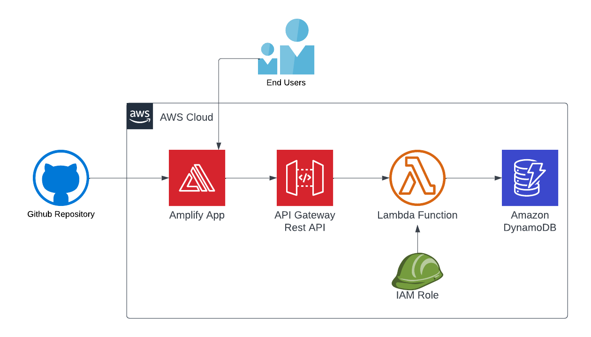

# serverless-web-app-amplify-hosting
𝐒𝐢𝐦𝐩𝐥𝐞 𝐰𝐞𝐛 𝐚𝐩𝐩𝐥𝐢𝐜𝐚𝐭𝐢𝐨𝐧 𝐰𝐢𝐭𝐡 𝐬𝐞𝐫𝐯𝐞𝐫𝐥𝐞𝐬𝐬 𝐛𝐚𝐜𝐤𝐞𝐧𝐝 𝐮𝐬𝐢𝐧𝐠 𝐀𝐦𝐩𝐥𝐢𝐟𝐲 𝐇𝐨𝐬𝐭𝐢𝐧𝐠

<!-- ### Used to follow the steps.

 - Step 1 : Build my blog site in HTML with CSS.

- Step 2 : Created an S3 bucket to store portfolio files.

- Step 12 : Finally, create an AWS code pipeline and deploy your latest release. -->